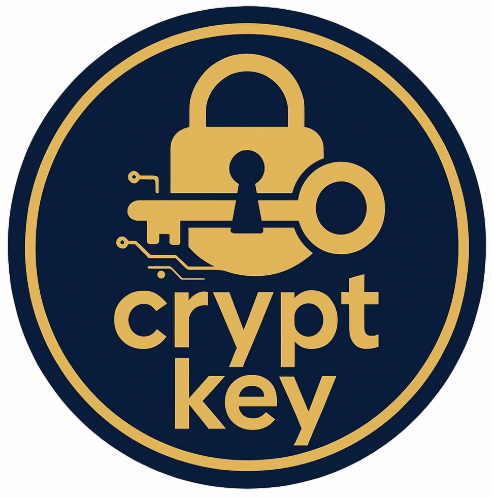

<a id="readme-top"></a>
<br />
<div align="center">
  <a href="https://github.com/Ryu-134/crypt-key">
    
  </a>

<h3 align="center">Crypt Key</h3>
  <p align="center">
    C++ based complex, customizable, offline password manager with a GUI built in Python’s Tkinter.
  </p>
</div>


<details open>
  <summary>Table of Contents</summary>
  <ol>
    <li><a href="#about-the-project">About The Project</a></li>
    <li><a href="#built-with">Built With</a></li>
    <li><a href="#features">Features</a></li>
    <li><a href="#prerequisites">Prerequisites</a></li>
    <li><a href="#installation">Installation</a></li>
    <li><a href="#usage">Usage</a></li>
    <li><a href="#security-and-deployment">Security & Deployment</a></li>
    <li><a href="#project-structure">Project Structure</a></li>
    <li><a href="#license">License</a></li>
  </ol>
</details>

---
<a id="about-the-project"></a>

## About The Project
Crypt Key lets you generate, view, and store strong passwords entirely offline.  
- **Password core** in modern C++  
- **Persistent storage** via a local CSV file  
- **Cross-platform GUI** using Python 3’s built-in Tkinter  

<p align="right">(<a href="#readme-top">back to top</a>)</p>

---
<a id="built-with"></a>
## Built With
* [![VSCode][vscode-badge]][vscode-url]
* [![Python][python-badge]][python-url]
* [![C++][cplusplus-badge]][cplusplus-url]

<p align="right">(<a href="#readme-top">back to top</a>)</p>

---
<a id="prerequisites"></a>
## Prerequisites
- A C++17 capable compiler (e.g. `g++`, `clang++`)  
- Python 3 (with `Tkinter`)  

<p align="right">(<a href="#readme-top">back to top</a>)</p>

---
<a id="installation"></a>
## Installation
1. **Clone the repo**  
    ```
    git clone https://github.com/Ryu-134/crypt-key.git
    cd crypt-key
    ```
2. **Compile the C++ backend**

   ```sh
   g++ -std=c++17 -Iinclude \
     src/passwordgenerator.cpp \
     src/FileHandler.cpp \
     src/main.cpp \
     -o CryptKey
   ```
3. **(Optional) Install Python dependencies**
   - Tkinter ships with most Python installs but install otherwise
   -  No extra packages required for the GUI.

<p align="right">(<a href="#readme-top">back to top</a>)</p>

---
<a id="features"></a>
## Features
- **Offline Use:** Local password storage and exporting
- **Password Generation:** Generates secure passwords using a mix of characters with user customizability.
- **GUI Interfaces:** Offers intuitive graphical user interfaces for ease of use.
- **Data Storage:** Saves password entries to a CSV file (`user_data.csv`).
- **File Handling:** Checks for existing entries and handles file operations.

<p align="right">(<a href="#readme-top">back to top</a>)</p>

---
<a id="usage"></a>
## Usage 
1. Run the GUI (ideally from USB drive):
   ```sh
   python3 gui.py
   ```
2. Once program is running choose from one of the following:
    1. Create a 16-character password with random characters.
    2. Create a custom length password ranging from 8-32 characters.
    3. Allow the use of special characters or to omit and generate alphanumeric only password.
    4. Allow the use of numbers in password.
    5. Allow for the use of upper case characters.

<p align="right">(<a href="#readme-top">back to top</a>)</p>

---
<a id="security-and-deployment"></a>
## Security & Deployment
- **USB-first design:** Keep `CryptKey` and `user_data.csv` together on a flash drive.  
- **Overwrite safety:** Prompt before replacing an existing entry.  
- **Physical security tips:**
  1. Attach USB to keychain or carabiner.  
  2. Use a tracker (e.g., AirTag) on your USB.  
  3. Consider a PIN-secured USB drive or BitLocker To Go.  

<p align="right">(<a href="#readme-top">back to top</a>)</p>

---
<a id="project-structure"></a>
## Project Structure
- `src/`: Contains the source code (.cpp files).
- `include/`: Contains the header files (.h files).
- `gui/`: Contains GUI-related source files and third-party libraries.
- `test/`: Contains the test cases built for each source file to ensure program integrity.
- `images/`: Contains the program logo and assets for README.
- `build/`: Contains the compiled executable and build artifacts.

<p align="right">(<a href="#readme-top">back to top</a>)</p>

---
<a id="license"></a>
## License
Distributed under the MIT License. See [LICENSE.txt][license-url] for details.

<p align="right">(<a href="#readme-top">back to top</a>)</p>

---
[license-url]: https://github.com/Ryu-134/crypt-key/LICENSE.txt
[vscode-badge]:  https://img.shields.io/badge/VS%20Code-007ACC?style=for-the-badge&logo=visual-studio-code&logoColor=white
[vscode-url]:    https://code.visualstudio.com/
[python-badge]:  https://img.shields.io/badge/Python-3670A0?style=for-the-badge&logo=python&logoColor=white
[python-url]:    https://www.python.org/
[cplusplus-badge]: https://img.shields.io/badge/C%2B%2B-00599C?style=for-the-badge&logo=c%2B%2B&logoColor=white
[cplusplus-url]:   https://isocpp.org/


--


